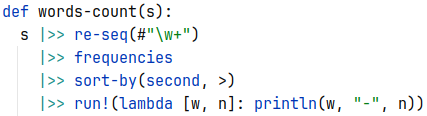

# cwp



Indentation-based syntax for Clojure.

The first place to land for those who would like to deep into practical dynamic functional programming language - Clojure,
but **don't like parentheses**. It provides familiar syntax, so it's easy to switch to it, from e.g. Python.

Features:
* Indentation-based, Python-like syntax
* Easy to write math operations
* In most cases separators: `,` - comma and `to`- keyword are optional
* Readable Clojure code generation

Being just a syntax for Clojure, it provides what Clojure has:
* Functional programming - immutable data structures, higher-order functions...
* Concurrent primitives
* Clojure/Java (JVM) ecosystem with a lot of libraries

In a nutshell it's a transpiler and a Leiningen plugin.

## Example

```ruby
def users: [{:name to "John",  :age to 20}
            {:name to "Anna",  :age to 32}
            {:name to "Smith", :age to 27}]

def avg-age(users):
  let ages to users |>> map(:age)
                    |>> reduce(+):
    ages / count(users) |> double

def greetings(users):
  let names to users |>> map(:name)
                     |>> str/join(", "):
    str("Hello, ", names, "!")

println(avg-age(users))   // 26.33333333333333
println(greetings(users)) // Hello, John, Anna, Smith!

```

## Documentation
* [Overview](doc/overview.md)


## Usage

Add to `project.clj` :plugins section:
```edn
  [cwp "<actual_version>"]
```

Add to `project.clj` builds info:
```edn 
  :cwp {:builds [{:in  "src-cwp"
                  :out "src-out"}]}
```
`:in` - folder where CWP sources are,
`:out` - folder for generated Clojure code

After that you can compile Clojure code to .jar.


## License

Copyright © 2024 ilevd