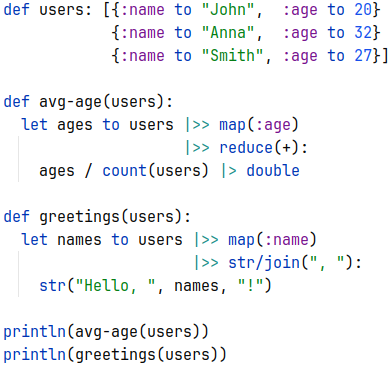
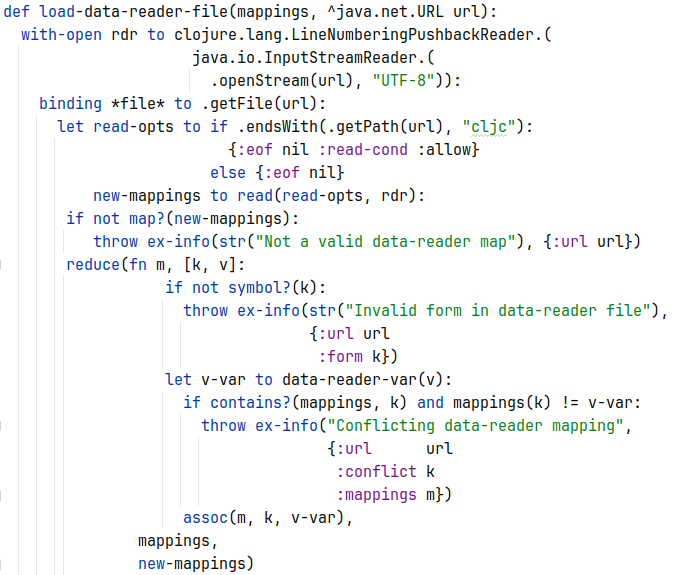

# cwp


[](https://clojars.org/org.clojars.ilevd/cwp)

Indentation-based syntax for [Clojure](https://clojure.org/).

It is a project for those, who would like to deep into practical dynamic functional programming language - Clojure,
but **don't like parentheses**. It provides familiar syntax, so it's easy to switch to it, from e.g. Python.

Features:
* Indentation-based, Python-like syntax
* Easy to write math operations
* In most cases separators: `,` - comma and `to`- keyword are optional
* Readable Clojure code generation

Being just a syntax for Clojure, it provides what Clojure has:
* Functional programming - immutable data structures, higher-order functions...
* Concurrent primitives
* Clojure/Java (JVM) ecosystem with a lot of libraries

It's a transpiler and a [Leiningen](https://leiningen.org/) plugin.

## Examples
Data manipulation 



Some function from [clojure.core](https://github.com/clojure/clojure/blob/clojure-1.11.1/src/clj/clojure/core.clj#L7918)
rewritten with CWP



Simple HTTP server with [HttpKit](https://github.com/http-kit/http-kit),
[Hiccup](https://github.com/weavejester/hiccup) and [Ring](https://github.com/ring-clojure/ring)

```scala 
ns test-expo.server
    require: [ring.middleware.params :as params]
             [ring.middleware.keyword-params :as kparams]
             [org.httpkit.server :refer [run-server]]
             [hiccup2.core :as h]

def fruits: ["Banana", "Apple", "Lemon"]

def get-html(user):
  [:div
    [:p {:style {:font-weight :bold}} str("Hello, ", user or "User", "!")]
    "Fruits:"
    for fruit to fruits:
      [:p {} fruit]]
  |> h/html |> str

def app(req):
 {:status  200
  :headers {"Content-Type" "text/html"}
  :body    get-html(req |> :params |> :name)}

run-server(app |> kparams/wrap-keyword-params |> params/wrap-params,
           {:port 8080})
```

## Documentation
* [Overview](doc/overview.md)


## Usage

Add to `project.clj` :plugins section:
```edn
[org.clojars.ilevd/cwp  "<actual_version>"] 
```

Add to `project.clj` builds info:
```edn 
:cwp {:builds [{:in  "src-cwp"
                :out "src-out"}]}
```
`:in` - folder where CWP sources are,
`:out` - folder for generated Clojure code

Files extensions mapping:
* `.cw` -> `.clj`
* `.cws` -> `.cljs`
* `.cwc` -> `.cljc`

Run: `lein cwp`

After that you can compile Clojure code to `.jar`.


## License

Copyright © 2024 ilevd